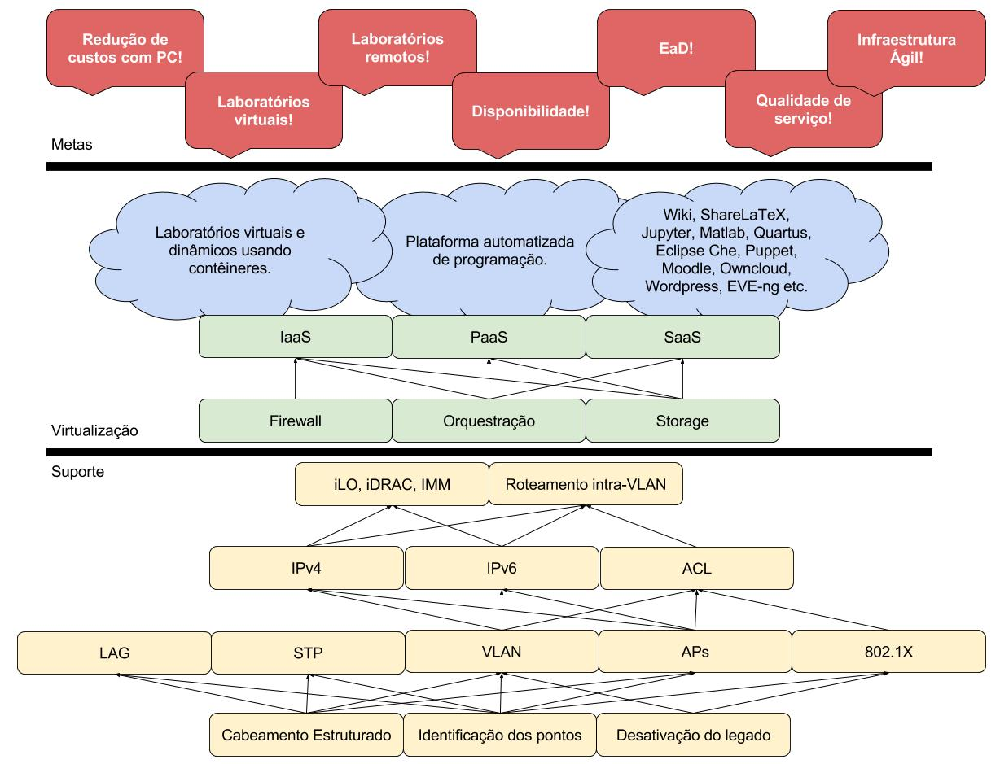
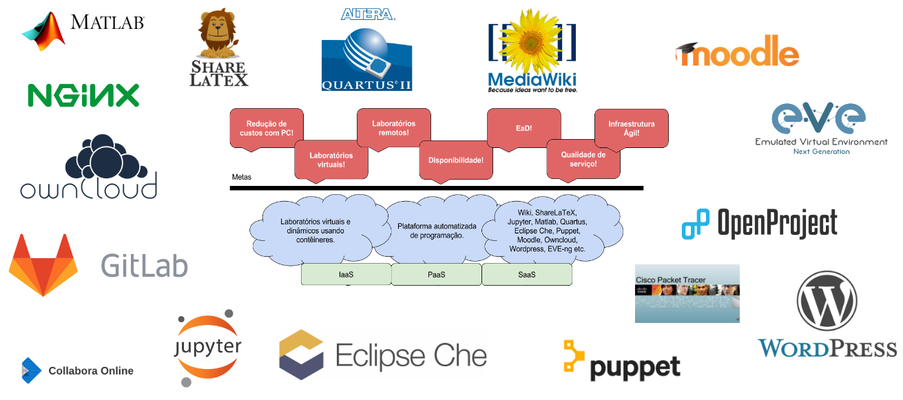

# Nuvem Privada com Kubernetes

Neste repositório é descrito o projeto de migração e implementação dos serviços para uma infraestrutura com contêineres “orquestrados” pelo Kubernetes. Está sendo implementado uma nuvem prívada em cima do projeto [coreos](https://github.com/ctic-sje-ifsc/coreos)

A implementação da estrutura kubernetes seguiu a [documentação oficial](https://coreos.com/kubernetes/docs/latest/getting-started.html). As configurações do kubernetes em si estão no projeto [coreos](https://github.com/ctic-sje-ifsc/coreos) em cada pasta no arquivo cloud-confid dos nós. Por exemplo: [aqui](https://github.com/ctic-sje-ifsc/coreos/blob/master/coreos0/user_data). O coreos0 é o master-API e os outros são workers.

## Porque migrar para container e k8s?
* Fluxo natural da tecnologia
* Economia de recurso/hardware
* Facilidade de agregar e manter novos serviços
* Centralização de gerência, monitoramento, administração...
* Serviços encapsulados podem ser movidos mais facilmente  local<=>nuvem privada<=> nuvem pública
* Controle de versão + moderação + automação de testes = CI
* Alta disponibilidade fácil
* Auto escalonamento fácil
* Google usa há 15 anos em todos os seus serviços, bilhões de containers por semana


## Estrutura do projeto macro:


## Serviços que podemos/queremos oferecer:


Nesse repositório estaremos colocando cada implementação desenvolvida. Estamos utilizando a seguinte estratégia de atuação:
* Migrar/instalar serviços já implementados em docker compose ou kubernetes
* Migrar serviços não críticos para testar a tecnologia
* Implementações novas importantes e críticas como fase de testes/migração
* Implementar serviços internos para testes de estabilidade e desempenho da tecnologia

## Armazenamento de estados e dados

Utilizamos uma abordagem para armazenamento de estados e dados onde esses não são salvos na mesma estrutura onde roda o Kubernetes, e sim em uma estrutura de armazenamento centralizada. Os PODS montam um armazenamento NFS e utilizam. A implementação do storage pode ser encontrada em [storage](https://github.com/ctic-sje-ifsc/storage).

Podemos ver um exemplo em:

```yaml
apiVersion: v1
kind: PersistentVolume
metadata:
  name: netbox-postgresql-base
spec:
  capacity:
    storage: 1Gi
  accessModes:
    - ReadWriteMany
  nfs:
    server: storage1
    path: /mnt/storage/storage/kubernetes/ifsc/sje/a/saas/srv/netbox/postgresql/base
```

# Implementação/migração dos serviços

## Nginx Front-End

(Boi Explicar)

## Netbox https://netbox.sj.ifsc.edu.br

O primeiro serviço migrado foi o [netbox](https://netbox.sj.ifsc.edu.br/), que já estava rodando em container em uma VM. Pode ser encontrado em [srv/netbox](https://github.com/ctic-sje-ifsc/kubernetes/tree/master/srv/netbox).

## Sharelatex https://sharelatex.sj.ifsc.edu.br

Implementamos o [sharelatex](https://sharelatex.sj.ifsc.edu.br/). A implementação é encontrada em [srv/sharelatex](https://github.com/ctic-sje-ifsc/kubernetes/tree/master/srv/sharelatex)

## Rocket.Chat https://chat.sj.ifsc.edu.br

Finalizamos a implementação do [Rocket.chat](https://chat.sj.ifsc.edu.br/) e utilizaremos ele em substituição do Slack, assim poderemos estar testando a estabilidade do kubernetes. O acesso é feito com o usuário do LDAP, tanto para alunos quando para Servidores. Implementação [srv/rocketchat](https://github.com/ctic-sje-ifsc/kubernetes/tree/master/srv/rocketchat).

## Mosquitto

Por necessidade do ensino foi implementado o Mosquitto. Implementação [srv/mosquitto](https://github.com/ctic-sje-ifsc/kubernetes/tree/master/srv/mosquitto).

## Nextcloud https://nextcloud.sj.ifsc.edu.br

O [Nextcloud](https://nextcloud.com) é um serviço Open Source de armazenamento e sincronização de arquivos privados, similar ao Dropbox (proprietário). O acesso é feito com o usuário do LDAP, tanto para alunos quando para Servidores. Implementação do Nextcloud [srv/nextcloud](https://github.com/ctic-sje-ifsc/kubernetes/tree/master/srv/nextcloud).

## Wordpress https://wordpress.sj.ifsc.edu.br

[WordPress](https://br.wordpress.org) é um aplicativo de sistema de gerenciamento de conteúdo para web, escrito em PHP com banco de dados MySQL, voltado principalmente para a criação de sites e blogs via web.  Implementação do Wordpress [srv/wordpress](https://github.com/ctic-sje-ifsc/kubernetes/tree/master/srv/wordpress).
